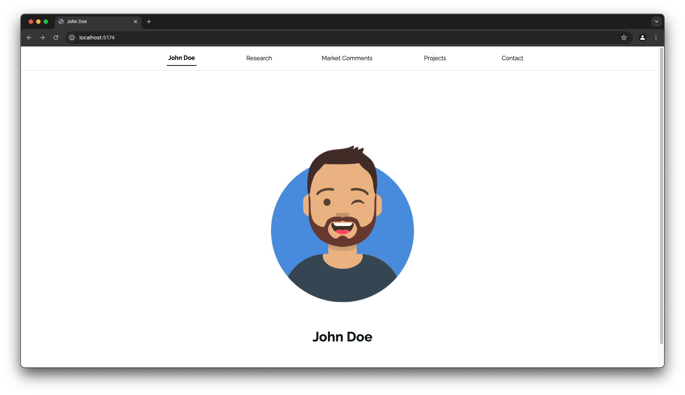
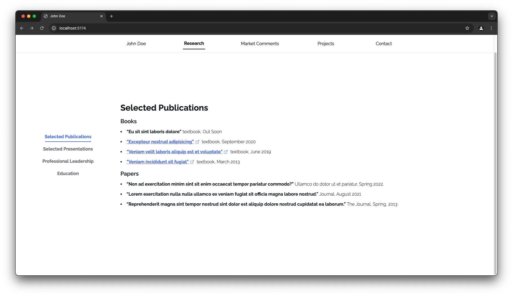
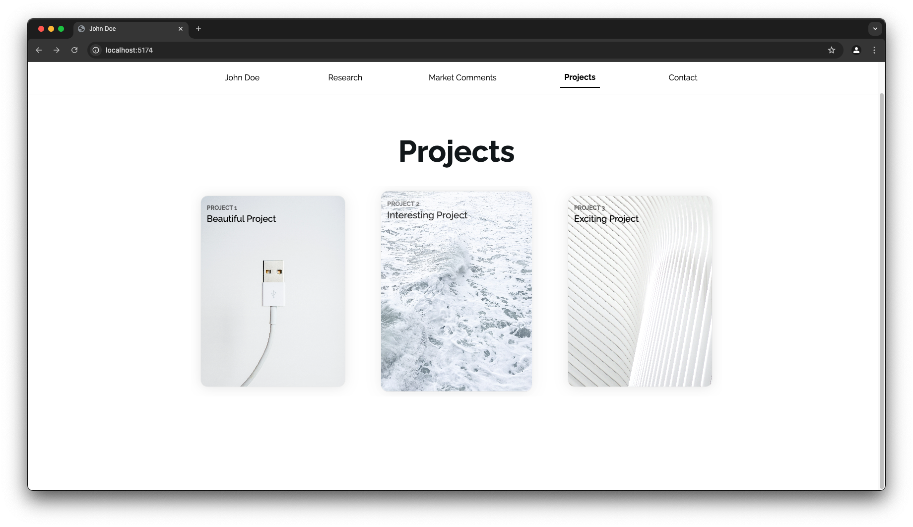

# Academic Portfolio
This is an example project of an academic portfolio. It is not intended as a template.

## Screenshots




The website is developed using **Vite + React + Tailwind + NextUI**.

To locally test and develop the website, simply download NodeJS and clone this repository.
Then, run:

```bash
npm install
npm run dev
```

In production, run:

```bash
npm run build
```

The files to be served will end up under the `/dist` folder.
